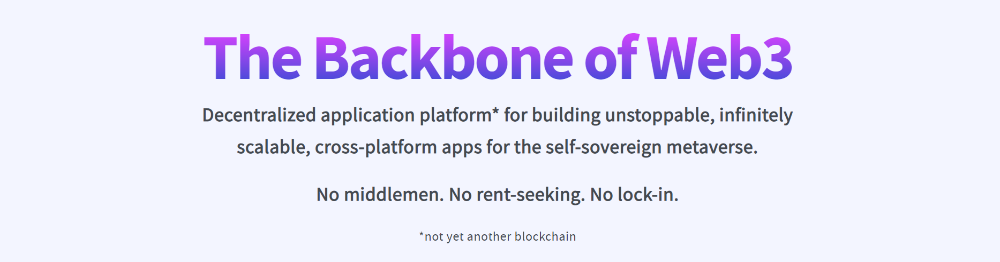

## Hello, welcome to Backbone DAO's Github 👋

> Backbone DAO is an open community of engineers, creatives, and operators. We come together to build technologies to help people and businesses become more self-sovereign.

Anyone who has skills to contribute is welcome to join.

## Backbone projects

1. 🌌 [backbone://](https://github.com/backbonedao/network-node) - user-to-user network » [Learn more](https://docs.backbonedao.com/docs/getting-started/overview/intro#-backbone) 
2. 🚀 [Core](https://github.com/backbonedao/core-alpha) - decentralized application container » [Learn more](https://docs.backbonedao.com/docs/getting-started/overview/intro#-core) 
3. 🆔 [Id](https://github.com/backbonedao/id) - self-sovereign global identity » [Learn more](https://docs.backbonedao.com/docs/getting-started/overview/intro#-id) 
4. 🤝 [DAO](https://github.com/backbonedao/dao) - decentralized digital organization » [Learn more](https://docs.backbonedao.com/docs/getting-started/overview/intro#-dao) 

*Please note that as Backbone is still in its Alpha phase, some of the repositories are private for now and available only for contributors and Alpha testers* 🙏

> If you would like to test-drive Backbone, you can request an invite at [updates.backbonedao.com](https://updates.backbonedao.com). If you'd like to contribute, jump to [Backbone Discord](https://dsc.gg/backbonedao).

## Our principles & values

Backbone community has a set of principles and values that drive our efforts to help humans to become more self-sovereign.

- **Self-sovereignty above all** - We believe each one of us is by default a self-sovereign being with inalienable right to decide for ourselves. Technologies available today don't reflect this truth, so we work diligently to make it a reality through Backbone technologies.
- **Decentralization over centralization** - We believe we as humans need to find equalibrium between complete decentralization and centralized efficiency while erring on the side of decentralization. This is why everything we build is maximally decentralized by design and users are free to create their own power structures on top.
- **Merits over posturing** - We believe people should be valued based on their merits in the community. This is why Backbone community is open and rewards anyone who contribute in making Backbone a reality, no matter where there are from, what they look like or what is their background.
- **User-to-user over master-to-slave** - We believe people should be able to communicate and transact without being bound to rent-seeking middlemen. The technologies today don't allow this, so this is why we are building Backbone technologies to popularize user-to-user model.

## How to find us

Like most communities, we employ multiple tools to get things done. Here's a set of places you can find us at...

- **Get news & updates** » [twitter/@backbonedao](https://twitter.com/backbonedao)
- **Discuss Backbone** » [discord/@backbonedao](https://dsc.gg/backbonedao)
- **View and contribute code (you are here)** » [github/@backbonedao/repos](https://github.com/backbonedao)
- **View open tasks** » [github/@backbonedao/projects](https://github.com/orgs/backbonedao/projects?type=new)
- **Read the docs** » [docs.backbonedao.com](https://docs.backbonedao.com)
